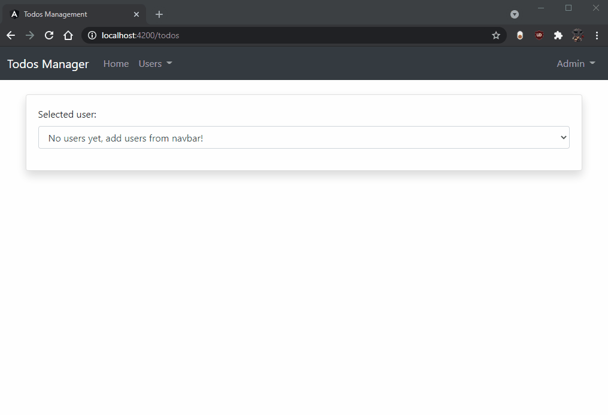

# Todos Management App

 This is a small CRUD application for demo purposes. It uses the two main classes **User** & **Todo** with a OneToMany relation respectively (each User has many Todos).
 
 ## Technologies

- The `server` is a REST API using **Spring Boot 2** with JDK 11.
- The `client` is an **Angular 12** app consuming the API.

## Usage

1. Start a database.
2. Launch the server, database options such as the name & the port can be configured in the `./server/src/main/resources/application.properties` file.
4. Configure the **apiUrl** variable in  `client/src/environments/environment.ts` to match your api route.
5. Serve & run your client application.

## Showcase

 
 

